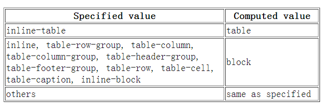

# CSS基础

# 1.CSS精灵图

`CSS Sprite`（CSS精灵）是一种将多个小图片合并到一张大图中的技术。通过在页面中引用这张大图，并设置合适的`background-position`和尺寸，可以显示出所需的小图标或背景图案。

**优点：**

- 减少`HTTP`请求数：将多个小图片合并成一张大图，减少了浏览器与服务器之间的请求次数，提高了页面加载速度。
- 提高性能：由于减少了请求数，减少了网络传输时间和延迟，加快了页面加载速度，提升了用户体验。
- 减小图片大小：合并后的大图可以使用更高效的压缩算法进行压缩，减小了图片的文件大小。
- 方便更换风格：只需要替换或修改一张大图中的小图标或背景图案，就可以改变整个页面的样式，维护和更换风格更加方便。

**缺点：**

- 图片合并麻烦：合并图片需要手动调整和拼接小图标或背景图案，需要一定的工作量。
- 维护麻烦：如果需要修改其中一个小图标或背景图案，可能需要重新布局整个大图，并且需要更新相应的CSS样式。

> 总结：`CSS Sprite`通过将多个小图片合并成一张大图，减少了`HTTP`请求，提高了页面加载速度和性能。它的优点包括减少请求数、提高性能、减小图片大小和方便更换风格。然而，它的缺点在于图片合并和维护的麻烦。

# 2.`display: none;`与`visibility: hidden;`的区别

> `display: none;`和`visibility: hidden;`都可以使元素不可见，但它们在实现上有一些区别。

**区别：**

- `display: none;`会使元素完全从渲染树中消失，不占据任何空间，而`visibility: hidden;`不会使元素从渲染树中消失，仍然占据空间，只是内容不可见。
- `display: none;`是非继承属性，子孙节点消失是因为元素本身从渲染树中消失，修改子孙节点的属性无法使其显示。而`visibility: hidden;`是继承属性，子孙节点消失是因为继承了`hidden`属性，通过设置`visibility: visible;`可以使子孙节点显示。
- 修改具有常规流的元素的`display`属性通常会导致文档重排（重新计算元素的位置和大小）。而修改`visibility`属性只会导致本元素的重绘（重新绘制元素的可见部分）。
- 读屏器（屏幕阅读软件）不会读取`display: none;`元素的内容，但会读取`visibility: hidden;`元素的内容。

> 综上所述，`display: none;`和`visibility: hidden;`虽然都可以使元素不可见，但在元素在渲染树中的位置、对子孙节点的影响、性能方面有所不同。选择使用哪种方式取决于具体的需求和场景

# 3.`link`与`@import`的区别

1. `<link>`是HTML方式，`@import`是CSS方式。`<link>`标签在HTML文档的`<head>`部分中使用，用于引入外部CSS文件；`@import`是在CSS文件中使用，用于引入其他CSS文件。
2. `<link>`标签最大限度地支持并行下载，浏览器会同时下载多个外部CSS文件；而`@import`引入的CSS文件会导致串行下载，浏览器会按照顺序逐个下载CSS文件，这可能导致页面加载速度变慢，出现FOUC（Flash of Unstyled Content）问题。
3. `<link>`标签可以通过`rel="alternate stylesheet"`指定候选样式表，用户可以在浏览器中切换样式；而`@import`不支持`rel`属性，无法提供候选样式表功能。
4. 浏览器对`<link>`标签的支持早于`@import`，一些古老的浏览器可能不支持`@import`方式引入CSS文件，而可以正确解析`<link>`标签。
5. `@import`必须出现在样式规则之前，而且只能在CSS文件的顶部引用其他文件；而`<link>`标签可以放置在文档的任何位置。
6. 总体来说，`<link>`标签在性能、兼容性和灵活性方面优于`@import`。

> 因此，在实际使用中，推荐使用`<link>`标签来引入外部CSS文件。

# 4.什么是FOUC?如何避免

> FOUC（Flash Of Unstyled Content）指的是在页面加载过程中，由于外部样式表（CSS）加载较慢或延迟，导致页面先以无样式的方式显示，然后突然闪烁出样式的现象。

**为了避免FOUC，可以采取以下方法：**

1. 将样式表放置在文档的`<head>`标签中：通过将样式表放在文档头部，确保浏览器在渲染页面内容之前先加载和解析样式表，从而避免了页面一开始的无样式状态。
2. 使用内联样式：将关键的样式直接写在HTML标签的`style`属性中，这样即使外部样式表加载延迟，页面仍然可以有基本的样式展示，避免出现完全无样式的情况。
3. 使用样式预加载：在HTML的`<head>`中使用`<link rel="preload">`标签，将样式表提前预加载，以确保在页面渲染之前样式表已经下载完毕。
4. 避免过多的样式表和样式文件：减少页面中使用的样式表数量和样式文件大小，优化样式表的结构和规则，从而加快样式表的加载速度。
5. 使用媒体查询避免不必要的样式加载：通过媒体查询（`@media`）在适当的条件下加载特定的样式，避免在不需要的情况下加载不必要的样式。

综上所述，通过优化样式加载顺序、使用内联样式、样式预加载和合理使用媒体查询等方法，可以有效避免FOUC的出现，提供更好的用户体验。

# 5.*如何创建块级格式化上下文(block formatting context),BFC有什么用

> BFC(Block Formatting Context)，块级格式化上下文，是一个独立的渲染区域，让处于 BFC 内部的元素与外部的元素相互隔离，使内外元素的定位不会相互影响

要创建一个块级格式化上下文（BFC），可以应用以下方法：

1. 使用`float`属性：将元素的`float`属性设置为除`none`以外的值，可以创建一个BFC。
2. 使用`overflow`属性：将元素的`overflow`属性设置为除`visible`以外的值，例如`auto`或`hidden`，可以创建一个BFC。
3. 使用`display`属性：将元素的`display`属性设置为`inline-block`、`table-cell`、`table-caption`等特定的值，可以创建一个BFC。
4. 使用`position`属性：将元素的`position`属性设置为`absolute`、`fixed`、`relative`或`sticky`，可以创建一个BFC。
5. 使用`contain`属性：将元素的`contain`属性设置为`layout`，可以创建一个BFC（仅适用于部分浏览器）。

> 在`IE`下, `Layout`,可通过`zoom:1` 触发

**BFC布局与普通文档流布局区别 普通文档流布局:**

- 浮动的元素是不会被父级计算高度
- 非浮动元素会覆盖浮动元素的位置
- `margin`会传递给父级元素
- 两个相邻元素上下的`margin`会重叠

**BFC布局规则:**

- 浮动的元素会被父级计算高度(父级元素触发了`BFC`)
- 非浮动元素不会覆盖浮动元素的位置(非浮动元素触发了`BFC`)
- `margin`不会传递给父级(父级触发`BFC`)
- 属于同一个`BFC`的两个相邻元素上下`margin`会重叠

**开发中的应用**

- 阻止`margin`重叠
- 可以包含浮动元素 —— 清除内部浮动(清除浮动的原理是两个 `div`都位于同一个 `BFC` 区域之中)
- 自适应两栏布局
- 可以阻止元素被浮动元素覆盖

# 6.*display、float、position的关系

- 如果`display`取值为`none`，那么`position`和`float`都不起作用，这种情况下元素不产生框
- 否则，如果`position`取值为`absolute`或者`fixed`，框就是绝对定位的，`float`的计算值为`none`，`display`根据下面的表格进行调整。
- 否则，如果`float`不是`none`，框是浮动的，`display`根据下表进行调整
- 否则，如果元素是根元素，`display`根据下表进行调整
- 其他情况下`display`的值为指定值
- 总结起来：**绝对定位、浮动、根元素都需要调整`display`**

综上所述，display、float和position之间存在一定的关系，它们的取值会相互影响元素的布局和显示方式。根据不同的取值组合，元素的display值可能会被调整。

# 7.清除浮动的几种方式，各自的优缺点

